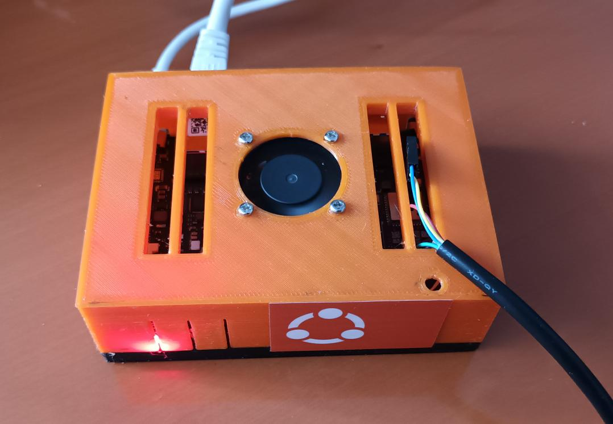
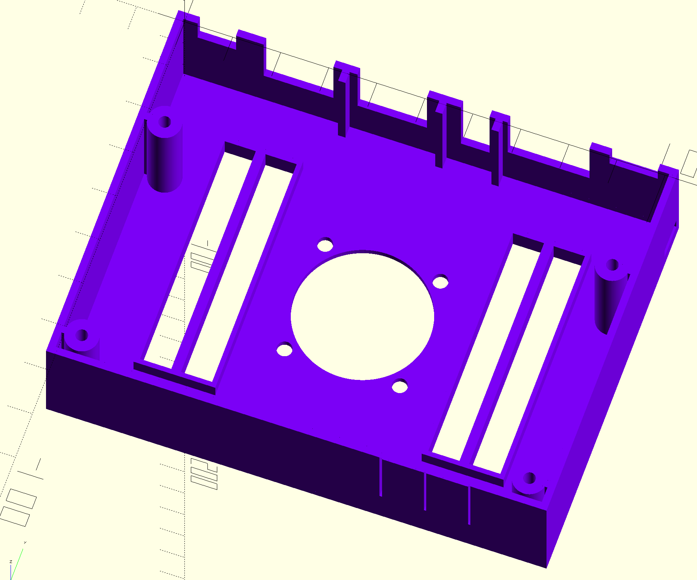

Case for StarFive VisionFive board
==================================

The repository contains the OpenSCAD file and the STL files for the case in
the image below.

You will need an M3 thread cutter for mounting the board with M3x8mm screws.

I use a 30x30x7mm 5V fan and a 20x20x10 cooler for the CPU.

License
-------

Creative Commons Attribution-ShareAlike 4.0 International Public License
(CC BY-SA 4.0)

Details see https://creativecommons.org/licenses/by-sa/4.0/
